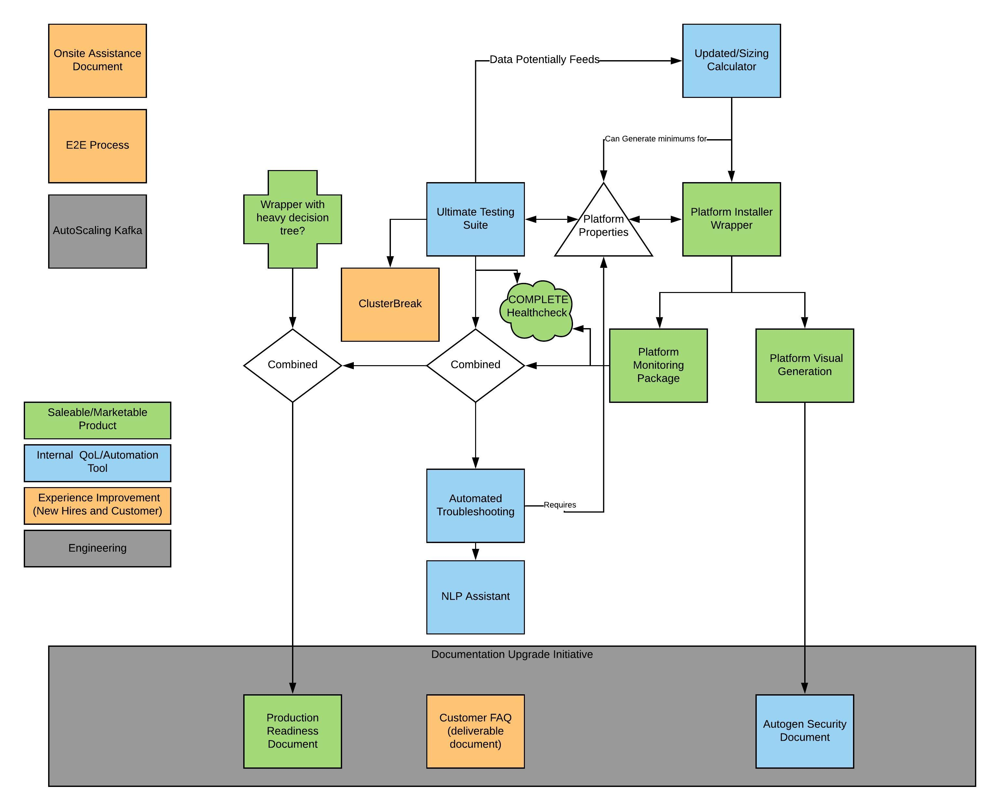

# CP-FAIR (Framework and Architecture for Improvement Resources

This repository at its core is a list of projects that are interconnected and are envisioned as working together to create a complete automation product suite. 
Ideally, this will be an undertaking that involves both the tools team as well as the field/professional services teams.

## Overview

Currently Tracking at: https://confluentinc.atlassian.net/wiki/spaces/~929252932/pages/1228145996/Projects

## Segments

### Live Projects
1. Updated/Sizing Calculator - Smart Sizing Calculator
2. Platform Installer Wrapper
2.1 Platform Monitoring Package
2.2 Platform Visual Generation
3. Autogen Security Document - Documentation Upgrade Initiative
4. Ultimate Testing Suite
5. ClusterBreak
6. Automated Troubleshooting
7. NLP Assistant
8. Production Readiness Document - Documentation Upgrade Initiative

### Separate Creations
1. Onsite Assistance Document
2. E2E Process
3. Autoscaling Kafka
4. Customer FAQ (deliverable document) - Documentation Upgrade Initiative

## Outlines

### Updated/Sizing Calculator - Smart Sizing Calculator
An update to the current broker/cluster sizing calculator at [Sizing Calculator](https://confluentinc.atlassian.net/wiki/spaces/SER/pages/1232885551/Tools). Essentially, I would like to be able to pop in throughput, ordering, EoS, processing (can’t calculate streams size), and a number of other things and this should pop out a ballpark recommendation.

### Platform Installer Wrapper
An installer that silently installs everything necessary. Run it with sudo and it will pull properties files for local rpm repos/etc. It will then check for installed stuff, OS version, etc for pre-setup (apt-get vs yum etc). Then, it will ask Ansible/K8s, ask some necessary info like broker IPs, broker ports, security, etc. This makes it nice and clean and simple but also allows for integration with a CI/CD pipeline in the background.

This gets extended to include a Tracing Framework Installer/Monitoring Installed by Default, a Mapping/Visual generator. In doing this, it created Platform Monitoring Package and Platform Visual Generation.
These can either be created as standalone tools or as extensions to our existing IP at Ansible. By creating it as an "add-on" or additional yml file, it becomes a marketable product to encourage upgrading to Confluent Platform or create a new category of "purchasable add-ons" or "Confluent Extensions". 
The particular sales and marketing methodology is to be left to the discretion of leadership.

### Platform Monitoring Package
Currently, we have limited monitoring installed by default for customer clusters. Understandably, C3 is meant to be the visualization tool of choice. However, many customers also integrate with external systems and it is important that we continue to provide a white glove treatment to those customers as well. C3 is slated for another re-write in 6.0 and beyond which may alleviate the concerns customers have with our current dashboard but does not address our issues/lack of automation in integrating with existing visualization tools like grafana/prometheus/datadog/etc. This platform monitoring package is meant to alleviate that by providing Confluent approved templates, appropriate metrics to monitor, alerts, and anything else a customer may need for integrating with an external visualization software so it is plug and play.

### Platform Visual Generation
As it stands, we do not have any platform visualization tools to create a complete cluster architecture overview. This could reasonably simply be done by allowing a brief scan of a subset of a network or even by importing an ansible yml file. This would allow for much easier automated document creation as well as a uniform standard to which reference architectures can be built, shared, and understood.

### Autogen Security Document - Documentation Upgrade Initiative
While we have a large amount of security documentation, we do not have one single deliverable to hand to customers that can be easily tailored to suite their needs. To better facilitate a white-glove treatment and build trust and rapport with customers, having a complete and extensive security document that can be tailored to their environemnt (a-la ps-recommendations asciidocs) is absolutely paramount. Otherwise, it appears as if we lack organization in our security methodology which does not look good. This ideally will leverage and collate a large amount of existing documentation and artifacts as well as add functionality to create a customized security document per-customer. This also enhances the customer story and overall understanding of their environment as it could be separated into 2 segments, 1) customized customer security information and 2) general security information and knowledge, where 1) is more useful for understanding customer story and can be added to customer profiles, and 2) provides a deeper understanding to the customer's security team.

### Ultimate Testing Suite
This is a multi-phase project that involved the creation of a complete testing suite that does the following:

    1. Performance Testing, both throughput and latency
    2. Chaos Testing, break things and see if it keeps working
    3. Troubleshooting ala Offline/Automated Troubleshooting Resource
    4. Healthchecking?
    5. Security Checking
    6. Tuning and Optimal Setting Generation

This will be elaborated further on the requisite linked page.

### ClusterBreak
To extend learning opportunities for those that learn best by doing or just for practice, ClusterBreak is meant to set up clusters via Ansible (with our current deployment of it), then set random things wrong with it to force people to troubleshoot. Ideally, this also feeds the Automated Troubleshooting tool (also occasionally referred to as self-healing coordinator) in terms of testing it. 

### Automated Troubleshooting
Currently, we have a vague methodology for troubleshooting and COPS has a lot of resources available on troubleshooting. Generally speaking, most issues fall into a number of  relatively simplistic categories. Based on some basic log analysis, the automated troubleshooting tool should be able to identify with reasonable amount of certainty what errors equate to what solutions. Even without automatically fixing them, running this tool should provide more simplistic answers such as "SSL Issue, check spelling, check properties files, check permissions, check connectivity, etc" rather than having to dig through log files, attempting to figure things out, etc. This also helps greatly in disconnected/airgapped environments where web access is not prevalent as it should be a self-contained tool.

### NLP Assistant
The goal of this is to have some sort of tool, potentially cloud linked where a user can ask questions in plain language and receive the correct support articles, documentation, etc. While this is probably better suited as an overarching search tool for version 1(something that combs Github, GDrive, Slack, Knowledge Base, etc) it would be quite cool and something worth boasting about as a version 2 tool.

### Production Readiness Document - Documentation Upgrade Initiative
One of the document types that we are missing is having a complete Produciton Readiness Document. While we do have the ops checklists, there is no clean, proper, complete document for ensuring a customers environment is ready to go into production. While the ops checklists may suffice, having an "official" wrapper around it with sign-offs, acknowledgements, known issues, chains of escalation, etc is much more professional and also serves to improve customer experience post-engagement. This builds confidence in the solution with the customer by having a clearly defined plan as well as all emergency buttons, links, contact information, and processes in the event of an emergency as well as acting as a stamp of approval from Confluent (or a stamp of approval with acknowledgements for anything that isn't best practice).

### Onsite Assistance Document
Integrated into [Conducting Engagements](https://confluentinc.atlassian.net/wiki/spaces/SER/pages/81133587/Support+During+An+Engagement)

### E2E Process
Integrating into [Conducting Engagements](https://confluentinc.atlassian.net/wiki/spaces/SER/pages/842794512/Conducting+Engagements). Essentially, this is an integration of our current pipeline, potentially some cleaning, and an extension to include the complete customer journey to better facilitate understanding and nurture the relationship between engagement personnel and customers.

### Autoscaling Kafka
This is more of an engineering progress project and something I had considered putting my hand into and trying various things out. It does get complicated rather quickly.

### Customer FAQ (deliverable document) - Documentation Upgrade Initiative
The [Customer FAQ document](https://docs.google.com/spreadsheets/d/1f7bRnJ8z1yaiSQo-nB0nymhbndwGQs1C5ZNNqC5ePUE/edit?usp=sharing) is meant to be a complete FAQ of many things that customers ask or have questions or concerns about. There is mixed feelings on this insofar as customer interaction and humanity versus white-glove treatment with "all" the answers a customer could ask. It would be ideal to generate this anyways so the decision can be made on a case by case basis.

##Documentation Upgrade Initiative
So far the following tasks have been completed
My wiki updated and integrated into [Conducting Engagements](https://confluentinc.atlassian.net/wiki/spaces/SER/pages/842794512/Conducting+Engagements).
Added "Becoming Fluent in Confluent" to homepage
Added Misc How-Tos, Resources/Tools to homepage, added Q2 2020 things to track
Updated bad links on homepage for timesheets and expenses, also linked definitions
Added "Common Delivery Collateral" and "Common Engagement Issues" to each engagement type.
